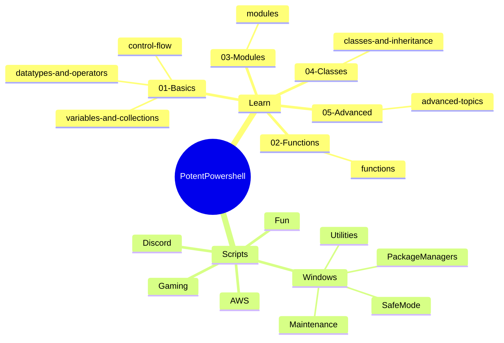

<div align="center">

# ⚡ PotentPowershell

### *Peering through the portal of PowerShell,*
### *Perched a repository, most powerful.*
### *Packed with scripts of all shapes and sizes,*
### *Poised to pounce on your admin crises.*

A dual-purpose PowerShell repository: an **educational reference** for learning PowerShell deeply, and a **practical toolkit** of real utility scripts.

---

[](https://learn.microsoft.com/en-us/powershell/)
[](https://www.microsoft.com/windows)
[](LICENSE)
[](https://github.com/Quadstronaut/PotentPowershell/commits/master)
[](https://github.com/Quadstronaut/PotentPowershell)
[](https://github.com/Quadstronaut/PotentPowershell)

---

[](#-learn----recommended-reading-order)
[](#-scripts----quick-reference)
[](#-repository-structure)
[](#-quick-start)
[](#-attribution)

</div>

---

## 🗺️ At a Glance

<a id="at-a-glance"></a>

| Wing | Purpose | License |
|------|---------|---------|
| 📚 `Learn/` | Annotated PowerShell deep-dive (5 modules, 7 files) | CC BY-SA 3.0 |
| 🛠️ `Scripts/` | Practical utility scripts across 6 categories | Original work by Quadstronaut |

<details>
<summary><strong>📦 Scripts inventory at a glance</strong></summary>

| Category | Scripts | Key theme |
|----------|---------|-----------|
| Windows Maintenance | 4 | SFC, DISM, Chocolatey, Windows Update |
| Package Managers | 3 | Chocolatey, Scoop, Python |
| Safe Mode | 2 | bcdedit boot flag wrangling |
| Utilities | 6 | Windows admin quality-of-life |
| AWS | 2 | CLI setup + account hardening |
| Gaming | 2 | Elite Dangerous multi-account, Steam verify |
| Discord | 1 | Webhook rich embeds |
| Fun | 1 | Pi via Leibniz formula |

</details>

---

## 🗺️ Repository Structure

<a id="repository-structure"></a>

```
PotentPowershell/
├── Learn/                          # Annotated learning files (CC BY-SA 3.0)
│   ├── 01-Basics/
│   │   ├── 01-datatypes-and-operators.ps1
│   │   ├── 02-variables-and-collections.ps1
│   │   └── 03-control-flow.ps1
│   ├── 02-Functions/
│   │   └── 01-functions.ps1
│   ├── 03-Modules/
│   │   └── 01-modules.ps1
│   ├── 04-Classes/
│   │   └── 01-classes-and-inheritance.ps1
│   └── 05-Advanced/
│       └── 01-advanced-topics.ps1
│
└── Scripts/                        # Practical utility scripts
    ├── AWS/
    │   ├── Invoke-AwsConfigure.ps1
    │   └── New-AwsAccount.ps1
    ├── Discord/
    │   └── Send-RichEmbed.ps1
    ├── Fun/
    │   └── Get-PiApproximation.ps1
    ├── Gaming/
    │   ├── Start-EDMultiAccount.ps1
    │   └── Invoke-SteamVerification.ps1
    └── Windows/
        ├── Maintenance/
        │   ├── Invoke-SystemUpgrade.ps1
        │   ├── Invoke-DiskCheck.ps1
        │   ├── Get-ErrorReport.ps1
        │   └── Invoke-SfcDism.ps1
        ├── PackageManagers/
        │   ├── Import-ChocolateyPackages.ps1
        │   ├── Update-PythonInstallation.ps1
        │   └── Invoke-ScoopBrowser.ps1
        ├── SafeMode/
        │   ├── Enter-SafeMode.ps1
        │   └── Exit-SafeMode.ps1
        └── Utilities/
            ├── Get-OpenWindows.ps1
            ├── Set-AdminAutoElevate.ps1
            ├── Remove-Silverlight.ps1
            ├── Get-ScreenGeometry.ps1
            ├── Sync-Directories.ps1
            └── Start-MSRewards.ps1
```

---

## 🗂️ How It All Fits Together

<a id="how-it-all-fits-together"></a>



---

## 📚 Learn/ — Recommended Reading Order

<a id="learn----recommended-reading-order"></a>

The `Learn/` files are annotated transcriptions of the [LearnXInYMinutes PowerShell guide](https://learnxinyminutes.com/powershell/), with deep commentary on *why* PowerShell works the way it does. Comments explain concepts that seem weird compared to Python, Bash, C#, or JavaScript.

| # | File | Key concepts covered |
|---|------|---------------------|
| 1 | `01-Basics/01-datatypes-and-operators.ps1` | Numbers, Banker's rounding, strings, escape characters, booleans, comparison operators (`-eq`, `-lt`), logical operators (`-and`, `-or`) |
| 2 | `01-Basics/02-variables-and-collections.ps1` | The `$` sigil, fixed-size arrays, ArrayList, hashtables, ordered hashtables, splatting, tuples |
| 3 | `01-Basics/03-control-flow.ps1` | if/elseif/else, switch (no fall-through!), foreach vs ForEach-Object, try/catch/finally, `-ErrorAction Stop` |
| 4 | `02-Functions/01-functions.ps1` | Parameters, implicit return, `[CmdletBinding()]`, BEGIN/PROCESS/END blocks, ValidateSet, splatting |
| 5 | `03-Modules/01-modules.ps1` | Install-Module vs Chocolatey/Scoop, PSGallery, writing modules, dot-sourcing |
| 6 | `04-Classes/01-classes-and-inheritance.ps1` | `::new()` vs `New-Object`, inheritance, `$this`, static members, enums, flags |
| 7 | `05-Advanced/01-advanced-topics.ps1` | Pipeline objects vs text (Bash comparison), jobs, PSRemoting, `&` vs `Invoke-Expression`, execution policy |

### 🔬 Things explained in unusual depth

<a id="things-explained-in-unusual-depth"></a>

<details>
<summary><strong>Click to expand — the peculiar PowerShell pitfalls, properly prosecuted</strong></summary>

| Topic | The Peculiarity |
|-------|----------------|
| **Banker's rounding** | Why `[Math]::Round(2.5)` returns `2`, not `3` |
| **Fixed-size arrays** | Why `+=` is O(n²) and when to use ArrayList instead |
| **Tuples** | What immutability actually gives you (safety, intent, thread-safety) |
| **`$` sigil** | Where it comes from (Unix shell heritage) |
| **`-eq` on arrays** | Why it filters instead of comparing |
| **`-and`/`-or` instead of `&&`/`\|\|`** | Why the shell reserved those symbols |
| **Backtick escape** | Why not backslash (Windows paths) |
| **`[CmdletBinding()]`** | Every common parameter you get for free |
| **BEGIN/PROCESS/END** | Why without PROCESS you only get the last pipeline item |
| **`&` vs `Invoke-Expression`** | Scope difference and why iex is dangerous |
| **Pipeline objects vs Bash text** | The single biggest conceptual shift |

</details>

---

## 🛠️ Scripts/ — Quick Reference

<a id="scripts----quick-reference"></a>

### 🪟 Windows Maintenance

<a id="windows-maintenance"></a>

| Script | What it does | Admin required |
|--------|-------------|----------------|
| `Invoke-SystemUpgrade.ps1` | Installs Chocolatey if missing, runs SFC + DISM in background, upgrades all Chocolatey packages, upgrades pip, installs Windows Updates (no forced reboot) | Yes |
| `Invoke-DiskCheck.ps1` | Runs `chkdsk C: /f /r` (auto-elevates; on a live C: drive, check is scheduled for next reboot) | Auto-elevates |
| `Get-ErrorReport.ps1` | Application/System event log error summary. Parameters: `-DaysBack` (default 7), `-ErrorThreshold` (default 10) | Recommended |
| `Invoke-SfcDism.ps1` | **Reference script** — documents every SFC and DISM repair command with annotations. Not meant to be run top-to-bottom; copy individual commands as needed. | Yes (per command) |

> [!TIP]
> `Invoke-SystemUpgrade.ps1` is the one-stop power-punch: Chocolatey + SFC + DISM + pip + Windows Updates, all in one pristine pass.

### 📦 Package Managers

<a id="package-managers"></a>

| Script | What it does | Admin required |
|--------|-------------|----------------|
| `Import-ChocolateyPackages.ps1` | Scans `Program Files` for executables that have matching Chocolatey packages; installs Chocolatey if missing, pins found packages, then upgrades them | Yes |
| `Update-PythonInstallation.ps1` | Detects installed Python versions via Chocolatey or registry; upgrades to latest, removes older versions, upgrades pip, optionally deletes virtualenvwrapper-style venvs (`~\Envs`) | Yes |
| `Invoke-ScoopBrowser.ps1` | Interactive Scoop package browser — shows info for each package and installs selected ones as background jobs | No |

### 🔒 Safe Mode

<a id="safe-mode"></a>

| Script | What it does | Admin required |
|--------|-------------|----------------|
| `Enter-SafeMode.ps1` | Sets `bcdedit` Safe Mode with Networking flag and immediately reboots. **Will reboot the machine.** | Yes |
| `Exit-SafeMode.ps1` | Clears the `bcdedit` safeboot value. Does **not** reboot — restart manually when ready. | Yes |

> [!WARNING]
> `Enter-SafeMode.ps1` **will reboot the machine immediately** after setting the bcdedit flag. Save everything first.

### 🧰 Utilities

<a id="utilities"></a>

| Script | What it does | Admin required |
|--------|-------------|----------------|
| `Get-OpenWindows.ps1` | Lists all processes with visible windows and their titles | No |
| `Set-AdminAutoElevate.ps1` | Sets execution policy to `Unrestricted` for current user, creates the PowerShell profile if absent, appends an auto-elevation snippet. **Note:** `Unrestricted` is broader than `RemoteSigned`. | Auto-elevates |
| `Remove-Silverlight.ps1` | Silently uninstalls Silverlight, removes registry entries, deletes remaining files from disk and AppData. Safe no-op if Silverlight is not installed. | Recommended |
| `Get-ScreenGeometry.ps1` | Reports full bounds and working area (excluding taskbar) for all connected monitors | No |
| `Sync-Directories.ps1` | Robocopy-based directory sync (`/E /XC /NP /ETA /MT:64`). Parameters: `-Source`, `-Destination` (both mandatory) | No |
| `Start-MSRewards.ps1` | Opens Edge to the MS Edge Search Clicker page and closes it after a configurable wait. Parameter: `-WaitSeconds` (default 120). Hardcodes Edge path; exits with a warning if Edge is not found there. | No |

> [!NOTE]
> `Set-AdminAutoElevate.ps1` sets execution policy to `Unrestricted`, which is broader than `RemoteSigned`. Understand the tradeoff before running.

### ☁️ AWS

<a id="aws"></a>

| Script | What it does | Admin required |
|--------|-------------|----------------|
| `Invoke-AwsConfigure.ps1` | Interactive AWS CLI setup: checks for saved credentials, offers to reuse them, installs/upgrades `awscli` + `awstools.powershell` via Chocolatey, prompts for region selection, validates with `aws s3 ls` | Yes (for Chocolatey) |
| `New-AwsAccount.ps1` | Guided AWS account hardening walkthrough: IAM user/group/policy, billing budget + SNS alerts, CloudTrail, admin account, SSO. **Note:** several steps are stubs (VPC/EC2 deferred to Terraform); some cmdlets (`Enable-IAMMFA`, `Test-IAMMFA`, `AWSPowerShellSSO`) may not exist in all AWS.Tools versions — verify module availability before running. | No (uses AWS APIs) |

> [!IMPORTANT]
> `New-AwsAccount.ps1` includes stubs — VPC/EC2 steps are deferred to Terraform. Verify that `Enable-IAMMFA`, `Test-IAMMFA`, and `AWSPowerShellSSO` exist in your installed AWS.Tools version before running.

### 🎮 Gaming

<a id="gaming"></a>

| Script | What it does | Admin required |
|--------|-------------|----------------|
| `Start-EDMultiAccount.ps1` | Launches multiple Elite Dangerous accounts simultaneously via Sandboxie Plus. **Requires editing the `$Accounts` and `$Sandboxes` arrays in the USER CONFIG section before use.** | No |
| `Invoke-SteamVerification.ps1` | Locates Steam via registry and runs `-verify_all` on the base installation. **Known issue:** per-game verification loop searches for appmanifests inside game subdirectories, but Steam stores them as `appmanifest_<appid>.acf` in the `steamapps` root — the per-game loop will silently find nothing. Only the base install verification works reliably. | Yes (registry) |

> [!CAUTION]
> `Invoke-SteamVerification.ps1` has a known bug: the per-game verification loop silently finds nothing. Only base install verification (`-verify_all`) works reliably.

> [!IMPORTANT]
> `Start-EDMultiAccount.ps1` requires you to edit `$Accounts` and `$Sandboxes` in the USER CONFIG section before the script will do anything useful.

### 🎉 Fun

<a id="fun"></a>

| Script | What it does | Admin required |
|--------|-------------|----------------|
| `Get-PiApproximation.ps1` | Approximates Pi using the Leibniz formula. Parameter: `-Iterations` (default 1,000,000). Slow to converge — millions of terms for a few correct digits. | No |

### 💬 Discord

<a id="discord"></a>

| Script | What it does | Admin required |
|--------|-------------|----------------|
| `Send-RichEmbed.ps1` | Posts a rich embed to a Discord channel webhook. Parameters: `-WebhookUrl`, `-Title`, `-Description` (all mandatory); `-Color` (decimal int, default 65280 = green), `-Thumbnail` (URL), `-Author` (hashtable with `name`/`icon_url`). Color must be decimal — Discord does not accept hex strings. | No |

> [!NOTE]
> `Send-RichEmbed.ps1` requires `-Color` as a **decimal integer** (e.g. `65280` for green). Discord's API does not accept hex strings.

---

## ⚡ Quick Start

<a id="quick-start"></a>

```powershell
# Run any script directly (some require admin)
.\Scripts\Windows\Maintenance\Invoke-SystemUpgrade.ps1

# Get help for any script
Get-Help .\Scripts\Windows\Utilities\Sync-Directories.ps1 -Full

# Open a Learn file in VS Code
code .\Learn\01-Basics\01-datatypes-and-operators.ps1
```

> [!TIP]
> For full per-script documentation, caveats, and troubleshooting, see the [GitHub wiki](https://github.com/Quadstronaut/PotentPowershell/wiki).

---

## 📜 Attribution

<a id="attribution"></a>

**Learn/ files** are based on the [LearnXInYMinutes PowerShell guide](https://learnxinyminutes.com/powershell/)
by Wouter Van Schandevijl and Andrew Ryan Davis, licensed under
[Creative Commons Attribution-ShareAlike 3.0 Unported](https://creativecommons.org/licenses/by-sa/3.0/).
Annotations and commentary by Quadstronaut.

**Scripts/** are original work by Quadstronaut unless otherwise noted in individual file headers.

---

## 🔗 Resources

<a id="resources"></a>

| Resource | Link |
|----------|------|
| 📖 PowerShell Documentation | [learn.microsoft.com](https://learn.microsoft.com/en-us/powershell/) |
| 🚀 LearnXInYMinutes — PowerShell | [learnxinyminutes.com](https://learnxinyminutes.com/powershell/) |
| 📦 PowerShell Gallery | [powershellgallery.com](https://www.powershellgallery.com/) |
| ✅ Approved Verbs for PowerShell Commands | [learn.microsoft.com](https://learn.microsoft.com/en-us/powershell/scripting/developer/cmdlet/approved-verbs-for-windows-powershell-commands) |

---

<div align="center">

*Practically perfect PowerShell, properly packaged, perpetually potent.* 💜

</div>
